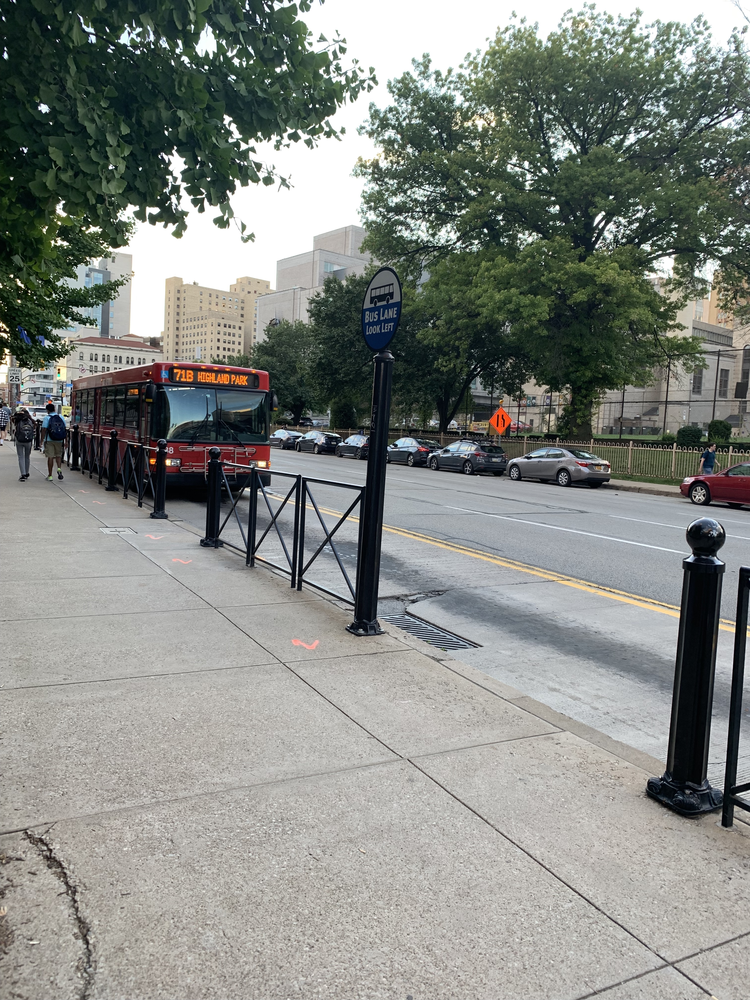

# How to Ride a Port Authority Bus Using Google Maps
-

> Using public transportation can be a very convenient option for traveling around your area. Many people do not ride the bus because they do not know how it works. These steps below will tell you how to ride a Port Authority Bus as long as you have Google Maps on your smartphone (and a way of paying the fare).

### Steps:
#### 1. Find and open Google Maps or download from the App Store.

#### 2. Type in the name or address of your destination.

#### 3. Select a bus route.
You want to pay attention to the name of the bus (Ex. "71B") because that is what bus you will be looking out for. These routes also provide a minute-estimation of how much walking is involved between your location and the bus stops. DO NOT exit out of Google Maps until you have arrived at your destination.

#### 4. Find your bus stop.
Make sure you are on the right side of the street or else you will be going the opposite direction!

#### 5. Board the bus.
Wait for any passengers to exit before boarding.

#### 6. Pay fare or tap ConnectCard.
If you have a Port Authority ConnectCard, tap on the orange card target until it lights up. You may also pay in cash. The fare for a single one-way ride is currently $2.75. You can insert bills and coins next to the card target.

#### 7. Find a seat.
Find an open seat on the bus and place any bags on your lap so the seat next to you is open for other passengers. If all seats are taken, you may have to stand and hold onto a rail or handle strap.

#### 8. Wait for your designated stop.
There may be a sign or screen that tells you what stop is coming up next. If not, you can track how close you are live on Google Maps. if your stop is coming up next, pull the yellow string along the windows to notify the driver that you are getting off.

#### 9. Get off at your bus stop.
Once the bus has stopped, exit at either the front or middle door.

#### 10. Continue using Google Maps if needed.
Your destination may or may not be in sight depending on how far you still have to walk. Google Maps will tell you where and how far you have to walk

